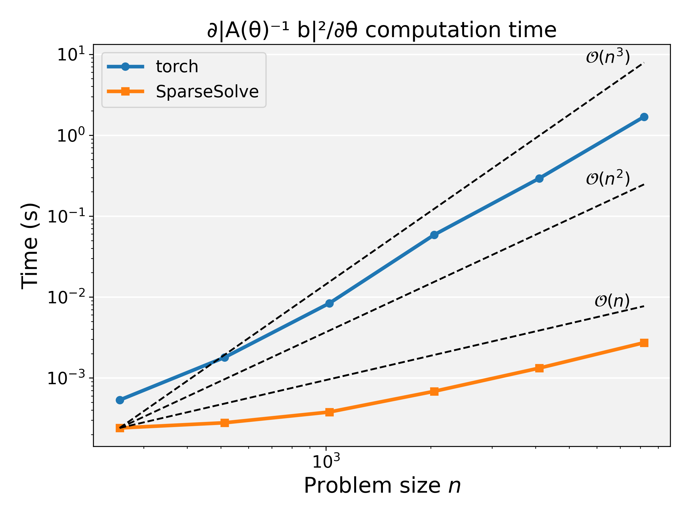

# PyTorch Sparse Solve

This small library provides a python class `SparseSolve` to use pytorch to back-propogate through function's which involve solving against a sparse matrix whose entries are differentiation variables. For example, consider that we have a function $f : \mathbb{R}^n \rightarrow \mathbb{R}$ where $f$ is defined as:

$$
f(\theta) = \frac{1}{2} \left\| A(\theta)^{-1} b \right\|^2
$$

and $A: \mathbb{R}^n \rightarrow \mathbb{R}^{n \times n}$ is some *sparse*-matrix function of $\theta$, e.g.,:

$$
A_{ij}(\theta) = \begin{cases} 
-\theta_i & \text{if } i = j + 1  \text{ or } i + 1 = j,\\
1 + \theta_i + \theta_{i+1} & \text{if } i = j,\\
0 & \text{otherwise}.
\end{cases}
$$

Using `torch.linalg.solve(A, b)` in the forward pass will result in a $O(n^3)$ dense solve operation and choke for large $n$. Instead, we can use `linear_direct_solve.solve(A, b)` which will use a sparse Cholesky solver in the forward pass and cache the factorization for efficient backward pass. The precise asymptotic behavior depends on the sparsity pattern and ability to permute the matrix well, but for common patterns it will be something like $O(n^p)$ where $1\leq p \leq 2$.

For the example above, as $n$ increases torch measures performance looking something like $n^{2.5}$
and SparseSolve measures performance like $n^{1.0}$.

## Use

Install with pip:

    python -m pip install . 

Run tests

    pytest

Run benchmark

    python examples/benchmark.py

## To-do list

 - [ ] Add mini example to README
 - [ ] Add fuller example (e.g., "Fast Quasi-Harmonic Weights for Geometric Data Interpolation")

You might also be interested in https://github.com/alecjacobson/indexed_sum

_Original code from Aravind Ramakrishnan._
